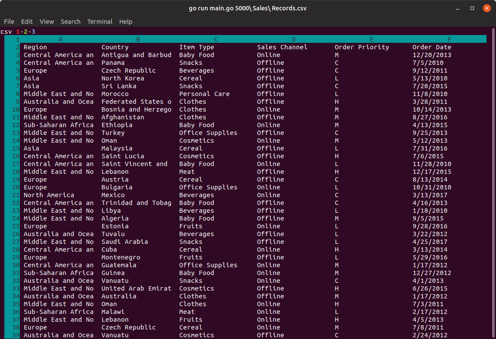

csv 1-2-3
=========

This package is a command-line CSV reader in the style of MS-DOS Lotus 1-2-3.

It's far from complete, but there's a screenshot:

Right now it's a very simple viewer. You can browse around with the arrow
keys, and the interface re-renders if the terminal is resized.

To exit, hit `ESC`.
